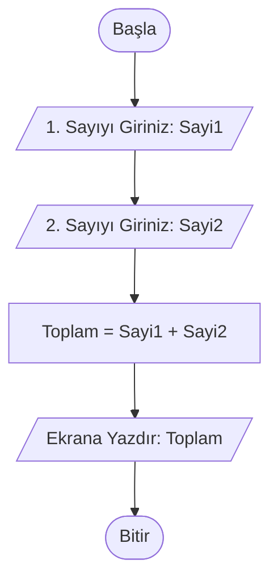
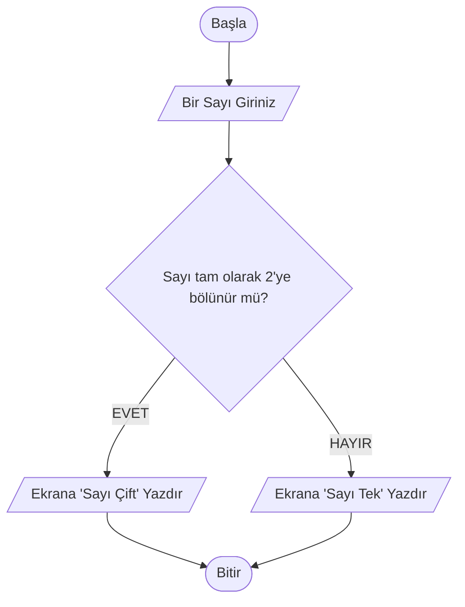
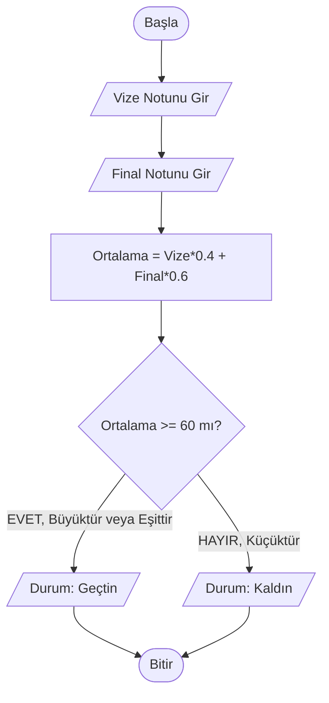

# Hafta 4: Akış Diyagramları: Semboller, Analiz ve Tasarım - I

## 1. Giriş ve Ön Hazırlık
Daha önceki haftalarımızda operatörleri, algoritma kavramını ve bir problemi sözel (metin) olarak nasıl adım adım çözeceğimizi (sözde kod tasarımlarını) öğrendik. Ancak sadece yazıyla ifade edilen uzun algoritmaları takip etmek, özellikle karmaşık problemlerde kafa karıştırıcı olabilir.

İşte tam bu noktada, yazıyla anlattığımız algoritma çözümlerimizi **görsel şekiller** vasıtasıyla geometrik sembollere aktarırız. Bu görsel şablonlara **"Akış Diyagramı" (Flowchart)** adını veriyoruz. 

Önlisans programımızda temel hedefimiz, kod yazma işlemine geçmeden önce algoritmik düşünce becerinizi görsel olarak zihninize kazımaktır.

---

## 2. Neden Akış Diyagramı Kullanılır?
- **Görsellik:** İnsan beyni, karmaşık metinlerden ziyade diagram ve şekilleri saniyeler içinde anlayıp yorumlayabilir. 
- **Hatayı Çabuk Görme:** Sürecin hangi yöne aktığı, şartların nerede ikiye ayrıldığı oklara bakarak saniyesinde tespit edilebilir. Mantık hatası (Logic Error) ihtimali çok azalır.
- **Standart Dil:** Siz Türkiye'de bir akış diyagramı çizerseniz, bunu İngilizce bile bilmeyen Çin'deki bir yazılımcı dahi sembollerin evrensel olması sayesinde kolaylıkla okuyup kodlayabilir.

---

## 3. Akış Diyagramı Temel Sembolleri
Diyagramlarımız kafamıza göre çizdiğimiz şekiller değildir; uluslararası standartları vardır. İşte en temel basit seviye sembollerimiz:

1. **Elips (Oval):** Programın başladığı ve bittiği noktaları gösterir. Algoritma her zaman bir *"Başla"* elipsi ile başlar, işler bitince *"Bitir"* elipsi ile sonlanır.
2. **Paralelkenar:** Dışarıdan bilgi okumak (klavyeden giriş yapmak) veya sadece basit ekrana yansıtma (çıkış) durumlarında kullanılır (Genel giriş / çıkış birimidir).
3. **Dikdörtgen:** İşlem, atama veya hesaplama kutusudur. Tüm matematiksel işlemler (toplama, çıkarma) burada yapılır. 
4. **Eşkenar Dörtgen (Karar / Şart):** Mantıksal karşılaştırmalar içerir. (Eğer sayı sıfırdan büyükse sağa git, küçükse aşağı git gibi). İçinden "Evet" ve "Hayır" olmak üzere iki ok çıkar.
5. **Yön Okları:** Sürecin / programın hangi yöne doğru akması gerektiğini temsil eder. 

---

## 4. Akış Diyagramı Tasarım Örnekleri

Aşağıda, 3 farklı seviyede algoritma problemi ve bunların Meramid yardımıyla oluşturulmuş standart akış diyagramlarını bulacaksınız. 

### ÖRNEK 1: İki Sayının Toplamını Bulan Program
**Sözel Algoritma:**
1. Başla
2. Bellekten birinci sayıyı iste (Sayı1).
3. Bellekten ikinci sayıyı iste (Sayı2).
4. İkisini Topla ve "Toplam" olarak sakla (Toplam = Sayı1 + Sayı2).
5. "Toplam" değerini ekranda göster.
6. Bitir.

**Akış Diyagramı Şeması:**

*Açıklama:* Başla ve Bitir elipslerle belirtildi. Dışarıdan Sayi1 ve Sayi2 alınırken Giriş/Çıkış sembolü (burada paralelogram niyetine /.../ kullanıldı) uygulandı. İşlem (toplama işlemi) standart dikdörtgen olarak tasarlandı.

---

### ÖRNEK 2: Girilen Sayının Tek mi, Çift mi Olduğunu Bulan Program
Bu örnekte işin içine bir "KARAR (ŞART)" işlemi, yani *Eşkenar Dörtgen* giriyoruz. Sisteme bir sayı verilecek, bu sayı 2'ye tam bölünüyorsa "Çift", bölünmüyorsa "Tek" denilecek.

**Sözel Algoritma:**
1. Başla.
2. Kullanıcıdan bir sayı girilmesini iste.
3. Sayının 2'ye göre modu (kalanı) 0'a eşit mi diye kontrol et. (Sayı % 2 == 0)
4. Eğer eşitse (EVET) ekrana "Sayınız Çifttir" yaz.
5. Eğer eşit değilse (HAYIR) ekrana "Sayınız Tektir" yaz.
6. Bitir.

**Akış Diyagramı Şeması:**

*Açıklama:* Algoritmamız ilk defa dallanma işlemi ("branching") yaptı. Karar kutucuğumuz soruyu sordu, sağa veya sola doğru EVET/HAYIR yanıtlarına göre gidişat şekillendi, ama sonuçta iki ok da programın kapanışı olan Bitir'de buluştu.

---

### ÖRNEK 3: Vize ve Final Notu İle Geçme Durumu Hesaplama
Üniversitelerde yaygın kullanılan dersten geçme sisteminin algoritmasıdır. Vizenin %40'ı ile finalin %60'ı alınır, toplamı (ortalama) eğer 60 ve üzerinde ise Geçti, 60'tan küçükse Kaldı yazılır.

**Sözel Algoritma:**
1. Başla.
2. Vize notunu gir.
3. Final notunu gir.
4. Ortalama hesapla: (Vize * 0.4) + (Final * 0.6)
5. Ortalama >= 60 şartını kontrol et.
6. Şart sağlanıyorsa (EVET) "Dersten Geçtin" yaz.
7. Şart sağlanmıyorsa (HAYIR) "Dersten Kaldın" yaz.
8. Bitir.

**Akış Diyagramı Şeması:**

*Açıklama:* Burada hem bir hesaplama (Dikdörtgen İşlem Alanı) kullandık hem de bir algoritmik şart (Karar - Eşkenar Dörtgen) kullandık. Üçüncü örneğimiz, günlük hayattaki otomasyonların bilgisayarın mantığında nasıl işlediğine en güzel yatkınlığı sağlar.

---

## 5. Haftalık Özet ve Alıştırma
Programlama yolculuğunuzda, problemleri algoritmaya çevirmeyi kolaylaştırmak amacıyla akış diyagramı modelleme dilini öğrendik. Doğru çizilmiş bir akış şeması, **C dili** başta olmak üzere her türlü programlama diline %99 doğrulukta bir çeviri demektir. O şema elinizdeyse, sadece çevirmek kalır.

**Laboratuvar / Bireysel Çalışma Soruları:**
1. Klavyeden kullanıcının girdiği bir doğum tarihine göre kullanıcının "Yaşını" hesaplayan (Günümüz Yılı - Doğum Yılı) formülü yazan ve akış diyagramını kendi defterinize semboller ile çizen bir algoritma tasarlayınız.
2. Akış sembolleri içindeki "İşlem / Atama (Dikdörtgen)" ile "Karar / Seçim (Eşkenar Dörtgen)" amaç olarak birbirinden neden ayrılmıştır? 

Önümüzdeki hafta, bu diagramlarda birden çok durum (iç içe kontroller) kısmını daha karmaşık senaryolarla (Akış Diyagramları II) işleyecek ve zihinsel hazırlığımızı tamamlayacağız. 
