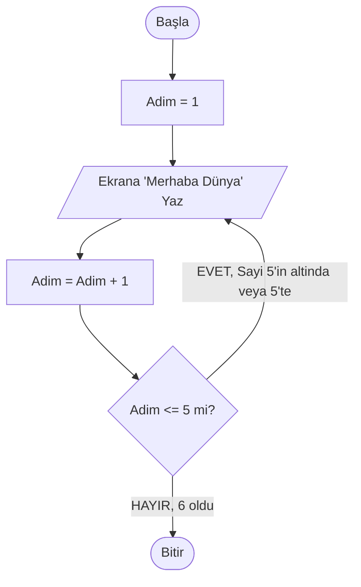
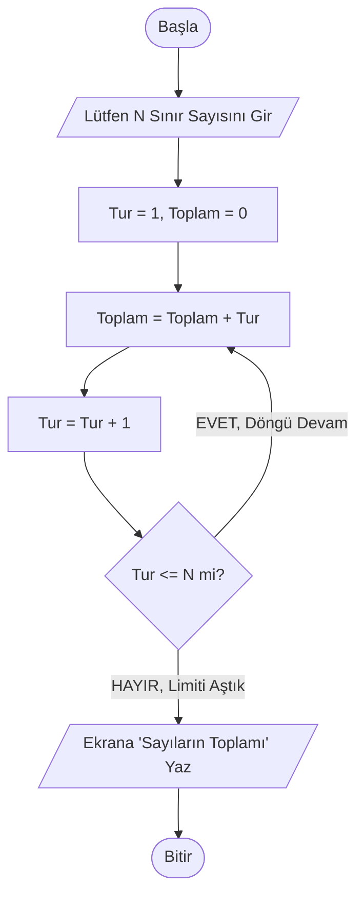
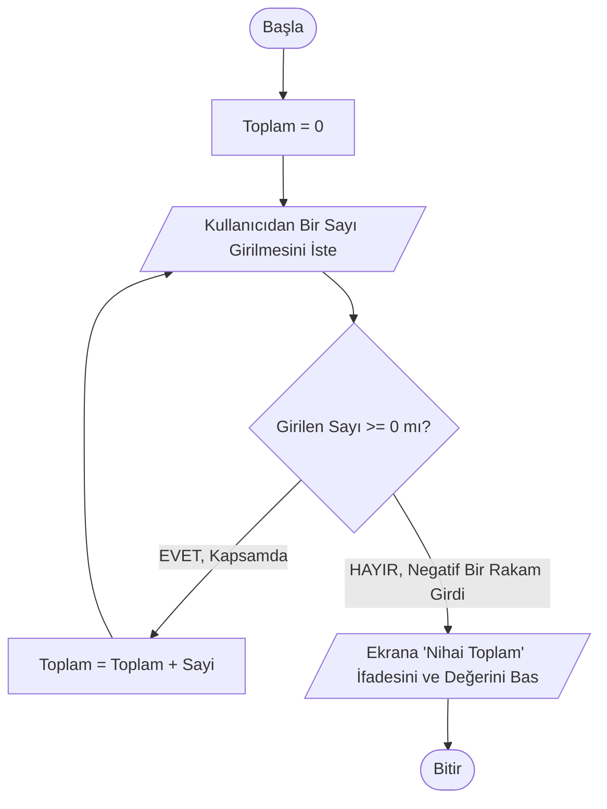

# Hafta 5: Akış Diyagramları: Semboller, Analiz ve Tasarım - II

## 1. Giriş ve Ön Hazırlık
Geçtiğimiz hafta akış diyagramı dünyasına ayak basmış, standart sembollerimizle (Elips, Eşkenar Dörtgen, Dikdörtgen) basit karar ve sıralı kodlamaların diyagram şemalarını incelemiştik. 

Hafta 3'te "Algoritma 2" konusunda Döngü (Tekrar) mekanizmalarını da sözel metin olarak çalıştık ama işin resmi haline dökmedik. O yüzden, bu 5. haftamızda özellikle Algoritmadaki en zorlayıcı olgu olan **Döngü ve Karmaşık İç İçe Karar** yapılarını "Akış Diyagramlarıyla" görselliğe aktarmaya odaklanacağız. 

**Hedefler:**
- Oku alıp geriye göndererek "Döngü (Loop)" akışını diyagramlaştırmak.
- Sayaç (Counter) ve Toplam mekanizmalarının geometrik yansımalarını öğrenmek.
- İki veya daha fazla karar (şart/Eşkenar Dörtgen) bağlanan durumlarda çoklu yolları idare etmek.

---

## 2. Döngüleri Diyagrama Dökmek Üzerine Ön Bilgi
Sıralı algoritmaların diyagramlarındaki oklar hep aşağı akar veya sağa / sola seker en nihayetinde de "Bitir" topunda birleşirdi. 
**Döngülü** akış şemalarında da karar oklarından biri (Genelde "Evet, daha döngü bitmedi" okudur bu), sürecin aşağıya akan mekanizmasına veda eder, *çizgi yukarı doğru seyrederek eski bir dikdörtgenin başına tekrar bağlanır.*

Döngünün sonsuza girmemesi için daima araya bir "Sayaç" koymalı ve her turda onu 1 attırmak üzere işlem satırını araya sıkıştırmalıyız. Karar şartı her turda bu sayacın son limiti aşıp aşmadığını test edip "Aşmadıysa Devam Et", "Aştıysa Döngüden Çık ve Bitir" denmelidir.

---

## 3. Akış Diyagramı Tasarım Örnekleri (Döngü / İleri Kararlar)

Aşağıda Döngü algoritması, Adım/Sayaç uygulaması üzerine 3 farklı "Mermaid" diyagramlı örnek ele alınmıştır.

### ÖRNEK 1: Ekrana 5 Kere "Merhaba Dünya" Yazdıran Döngü Algoritması
Yazılım serüvenlerinde "10 kere tekrar et" komutunu diyagramla ifade edeceğiz. Klasik mantıkla art arda 5 tane çıktı diktörtgeni çizebilecek olmamıza rağmen, ya 100.000 kere istenirse diye döngü sistemini kullanacağız.

**Algoritma Adımları:**
1. Başla
2. Adim isimli değişkene 1 ataması yap (Adım sayacı)
3. Ekrana "Merhaba Dünya" çıkışını ver.
4. Adim = Adim + 1 yap
5. Eğer Adim <= 5 ise Adım 3'e GİT. (Büyükse Adım 6'ya devam et)
6. Bitir.

**Akış Diyagramı Şeması:**

*Açıklama:* Dikkat ettiyseniz, E harfinden çıkan "Evet" cevabı, algoritmayı bitirmiyor ve yukarı, C'nin bulunduğu noktaya tekrar bir Ok yolluyor. İşte kodlama dünyasında döngü denilen kısım bu yukarı giden optur; şart bitene kadar burada bir hortum oluşacaktır.

---

### ÖRNEK 2: Kullanıcı Tarafından Belirlenen N Sayısına Kadar Toplam Bulma (1'den N'ye) 
Diyelim ki programı çalıştıran kişi sisteme 4 sayısını yazdı. Program 1+2+3+4 hesaplayacak ve bulduğu 10 sayısını çıktı olarak kullanıcıya gösterecek. Limitimiz klavyeden belirleniyor.

**Algoritma Adımları:**
1. Başla.
2. Dışarıdan hedeflenen limit olan sayı girişini (`N`) iste.
3. Arka plan hafızasında `Tur=1` ve `Toplam=0` değişkenlerini yarat.
4. `Toplam = Toplam + Tur` (0 olan toplama, turun değerini aktar).
5. `Tur = Tur + 1` (Turu bir sonraki aşamaya çek, yani 2 yap vb.)
6. Püf Noktası – Soru Sor: `Tur <= N` değerine hala uygun mu? Doğruysa 4. adıma geri fırlat.
7. Eğer şart ihlal edildiyse, ekrana `Toplam`ı gönder.
8. Bitir.

**Akış Diyagramı Şeması:**

*Açıklama:* Tur değeri limit sayısını her bir arttırdığında D e bağlanan koca bir tur çemberine girer. Limit aşıldığında sistem çemberi kollarından kopararak Hayır okunu seçer ekrana skoru yazar. Döngü ile Karar mekanizmasının sanatına harika bir taslaktır.

---

### ÖRNEK 3: Kullanıcı Pozitif veya Sıfır Girdiği Sürece Girdiği Sayıları Toplayan Sistemin Akış Şeması
Bu örnek, yazılımda "Sonsuz Döngüye veya Şarta Bağlı Döngüye (While)" örnektir. Limiti önceden bilmeyiz, tek derdi; "Kullanıcı önüne gelen ekrana Eksi (-) sayılar (-4 gibi) girmediği SÜRECE" işlemi tekrarlatıp yazılan sayıları kumbaraya atsın, kullanıcı negatif girer girmez o sayıyı almayıp eskilerin tüm toplamını verip işlemi kırsın (programı bitirsin).

**Algoritma Adımları:**
1. Başla.
2. Hafızada Toplam değerine sıfır ver (`Toplam=0`).
3. Dışarıdan Sayı İste.
4. Girilen `Sayi >= 0` mı sorusunu Karara bağla.
5. Eğer Sıfır'dan büyük/eşitse (Şart Tutuyorsa): 
   `Toplam = Toplam + Girilen Sayi` formülünü yap.
    Ardından yine Adım 3'e çık, yeni bir sayı girmesini iste (Yine Karara gelsin vb).
6. Eğer Sıfır'dan değil, Eksiyse (negatif-şart tutmuyorsa): 
   O koldan kop, Ekrana "Su Ana Kadar Girilen Toplamınız= Toplam", yazdır.
7. Bitir.

**Akış Diyagramı Şeması:**

*Açıklama:* Bu döngümüzde net bir 'Sayac = Sayac+1' durumu yok, şart kullanıcıya bağlandı. Kullanıcı klavyeden -5 yazmadığı müddetçe, sistem sonsuza kadar onu (C) aşamasıyla (E) aşaması arasında defalarca çalışabilecek bir kafesin içerisine attı. Yazılımların interaktif olarak insana hizmet etmesini saplayan kilit prensip buradaki diyagramdır.

---

## 4. Haftalık Özet
Beşinci haftamızı tamamlarken, artık herhangi bir kod komutu görmemiş olsanız bile bilgisayarların hangi mantıkla milyarlarca satır döngüyü sıfır hata ile çözdüğünün matematiksel "Düşünce" yapısına hakimsiniz. Bu diyagramları tasarlamak işin C, Python, C# ile kod yazma kısmından her daim daha önemlidir! Mimariyi iyi çizersek, ustalıkla tuğlaları üzerine ekleriz.

**Alıştırma Sorusu:**
1. Kendinize ait bir "Faktöriyel Hesaplayan" (Girilen 5 sayısı için 5x4x3x2x1 yapan algoritma) Akış Diyagramını defterinize paralel, kare, eşkenar çokgen ve okları kullanarak kendi limitlerinizle çizmeye çalışın...
2. İkinci soruyu düşünün: Herhangi bir Akış diyagramında Eşkenar dörtgenden "Çıkan Oklardan İkisi Birden (Hem Evet Hem Hayır)" tek bir noktada tekrar birleştirilebilir mi neden?
