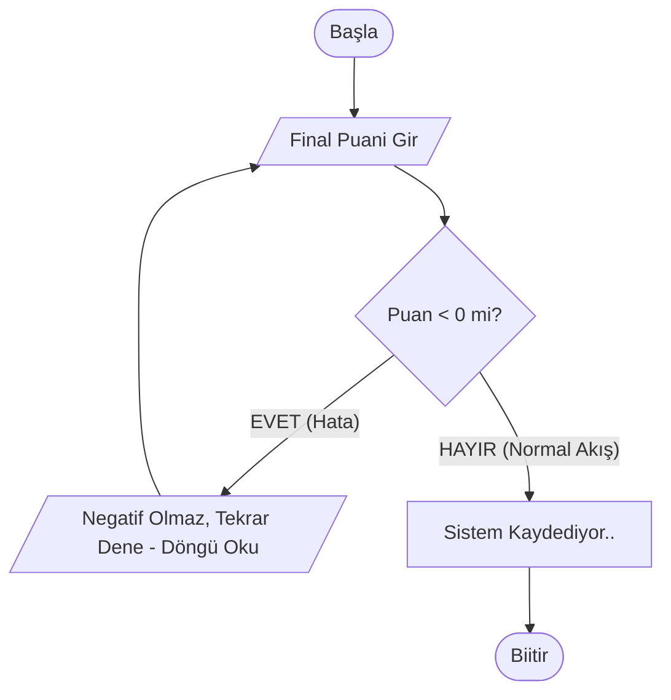

# Hafta 14: Genel Tekrar ve Dönem Sonu Değerlendirmesi

## 1. Giriş ve Döneme Bakış
Saygıdeğer öğrencilerimiz, "Algoritma ve Programlamaya Giriş" dersimiz boyunca 13 haftalık yoğun bir eğitim serüvenini tamamladık. Sıfırdan bir donanımın veriyi nasıl anladığı ile başlayıp, problem çözme sanatına, akış diyagramlarına, C dilinin kurallarına ve nihayetinde matris ile sıralama (Bubble sort vb.) yapılarına uzanan büyük bir yolculuk gerçekleştirdik.

Bu son haftamız, yeni bir konu öğrenmekten ziyade, baştan sona tüm modülleri birbiriyle bütünleştirerek "Kuş Bakışı" dönem tekrarı yapmak için tasarlanmıştır.

**Hedeflerimiz:**
- Algoritma ile kodlama ilişkisindeki köprüyü tekrar kavramak.
- Temel bileşenleri (Değişkenler, Operatörler, Döngüler, Şartlar) süzgeçten geçirmek.
- Dönem boyu öğrendiklerimiz arasında sık karşılaşılan hataları vurgulamak.

---

## 2. Programlamanın Zihinsel Temeli (Hafta 1-3 Tekrarı)
Sürekli vurguladığımız gibi programlama dili bilmek (C kodu yazabilmek) sadece bir "kural" (syntaX) bilmektir. Asıl önemli olan "Problemi nasıl parçalayacağını bilmektir" ve buna biz `Algoritma` diyoruz.
- Bilgisayar elektronik tepkimeleri 0 ve 1 olarak algılar, Derleyiciler (Compiller) İngilizce harflerle yazdığımız kodları derleyerek makinenin 0 ve 1 diline basarlar.
- Problemler "Giriş (input) -> İşleme Süreçleri -> Çıkış (output)" olarak süzülür.
- Operatörler Algoritmanın kalbidir. Matematik (`+`, `-`, `/`, `%`) kadar mantık süzgecini ( `&&` VE, `||` VEYA, `! ` DEĞİL ) kurmayı ilk haftalarda cebimize oturttuk.

---

## 3. Akış Diyagramları Dönem Tekrarı (Hafta 4-5) 
Bir inşaat mühendisi eve başlamadan kroki çizmek zorundaysa, bir yazılımcının "Flowchart" çizmeye o denli ihtiyacı vardır.

**Geometrik Temellerin Hatırlanması:**
- **Oval/Elips (Başla-Bitir):** Giriş çıkış tapusu.
- **Eşkenar Dörtgen (Karar / IF):** Soru sorduğumuz ve daima Evet/Hayır (Doğru/Yanlış) ile min. iki koldan seken diyagram.
- **Dikdörtgen (İşlem / Atama):** Sadece işlemler ( A=A+B gibi) ve formül aktarımı yapar.


*Görüldüğü üzere Akış Diyagramlarındaki "Okların" kendi üzerine attığı turlar, kodlara "DÖNGÜ/SAYAÇ" ve "Karar IF" leri olarak kazınan evrensel evcil mekanizmalardır.*

---

## 4. C Programlarının Alt Yapısı ve Bileşenleri (Hafta 6-8)
Akıştan koda geçtiğimiz dönem olan C Dili kuralları. C gibi köklü bir dil, hafızayı çok cimri kullanır.
Değişken tanımlamadan aslen hareket edemeyiz. Sisteme veri tipini bildirtmeye mahkumuz: 
1. `int` : Tam sayı yapısı. Ekranda `%d` çağırılır.
2. `float`: Süratlı (küsürlü) ondalık değer. Yansıması `%f` dir.
3. `char`: Tek seferli bir Karakter ('x'). Çağrısı `%c` dır.

**Kullanım Hatası Tuzağı:** "Değişkenleri büyük-küçük harfle yazar ve sonrasında hata alırım (C Dili Case Sensitivedir)". Komut bitimine Noktalı virgül (`;`) konulmasını hatırlayanız (C'de en büyük syntax fail'leridir). `scanf( "%d", &AdresKarti ) ` bölümünde Ampersand( `&` ) i koymayı unuttuğumuz için verilerin klavyeden sekmesidir (En çok unutulan!). 

### 4.1.  Şart (Karar) Bloğu: `if - else if - else`
Bir akış şemasının can noktası.. Bilgisayar kendi mantığını konuşturamaz, siz sormalısınız.
```c
 if ( Bakiye >= Fiyat  && SicilTemiz == 1 ) {
       // Ikiside ayni anda (&&) okeyse, urun satilir.. 
 } else {
       // Hicbiri degilse Cihaz C-Kolanin bu tarafina atlar..
 }
```

### 4.2. Döngü Çemberleri: `for` ve `while`
Sayısız kod yazmaktansa bloğu başa sarmak(Turlamak..).
- `while()` içerisi şart "Doğru yansıttığı sürece" döner. Sayaçları veya (Kopartma kırıcı eylemi `break;` ) el gücünüzle içeresine atmak sizlerin görevindedir.
- `for( baslangic;  bitisin sarti;  sayac ) `  Üç silahşörleri de  ana yörungesinde bulundurup pratiklik, Arraylere tura basıp okumasındaki can damarıdır!  

---

## 5. İleri Düzey Taşıyıcılar ve Modüller (Hafta 9-13)
Dönemimizin son çeyreği "Profesyonelleşen Bir Mühendislige" zemin atmıştı:

1. **Diziler (Arrays):** Aynı tarzda verilerden (Yüzlerce isçinin Maaşı) 500 kere değişken (`int X , M, b, c` vs..) kurgulamaktansa; `int Maaslar[500]` deyip tren katarına dökme işidir... Unutulmaz kural, Index sayıları ( 0 dan Baslamasıdır ) !! Ve Arrayslerle ile Forlar birbirine zincirlemli mükemmel çalışırlar.
2. **Fonksiyonlar (Functions / `void` ve Parametrik GeriDönenler):** Dev mimariyi sadece ve sadece kalabalık Spagetti (Tek Main Parantezi içerisnde )  yığarsanız Proje yönetilemez hal alır ! Ana kısımdan sökülüp `ToplamiCekarttir( float Tutar1) ` tipindeki mini Metotçular oluşturulmalıdır.. Onlar Return (Kuryelerler) cevap verir . Sizde sadece Main den adını seslenir ve komutunu oynatılır tutarlarsınız ! 
3. **Algoritma Pratikliği ve Problem Süzme :** Max- Min Bulmalarda for esnasında kralı baştan tutmak; Arrayların elemanlarını Bubble Sort benzeri Geçici Kutularla (Swap, Temp takas mantıklarıyla) C dilinin döngüsel for gücünde kaynatılarak Liste sırlama  programlarına geçilmiştir .

---

## 6. Veda ve Daha İlerisine Taşıyacak Kariyer Öğütleri
C dili size bir dilin programlama kalbini dikte ettirerek çokça sabrınızı dener. Eğer siz (Sıralı if ler, Scanf girişlerine ki o mantıkla ve Fonksiyon yollamaların) mekanizmaları ne amaçla koyduğumu sezerseniz Python da 1 haftada uzmanlaşmaya ;  C# & Java da Nesne (Object) disiplinlerine direk basamağa oturrsunuz . 

Algoritma mantığı bitmez, yeni bir proje geliştirdiğinizde "Hadi Kod yazalım C compiler Acayım!" denmez. Eline Kurşunlu Kalem ile A4 alınarak :  Adım  1 "Kullanıcı Cıkıyor" .. Adım 2 : "Bunu For lamalıyım " diye taslak cizilmesine Mühendisligin Analitiksel Düşüncesi diyoruz ve Önlisans programımızda sizin için biçilmiş misyon budur.. 

Başarılar dileriz, Geleceğin parlayan Programcıları! 
(Algoritma & Programlamaya Giriş Akademik Dönem Sonudur..)
